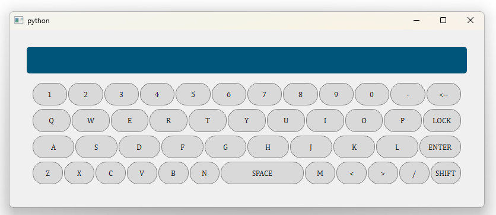
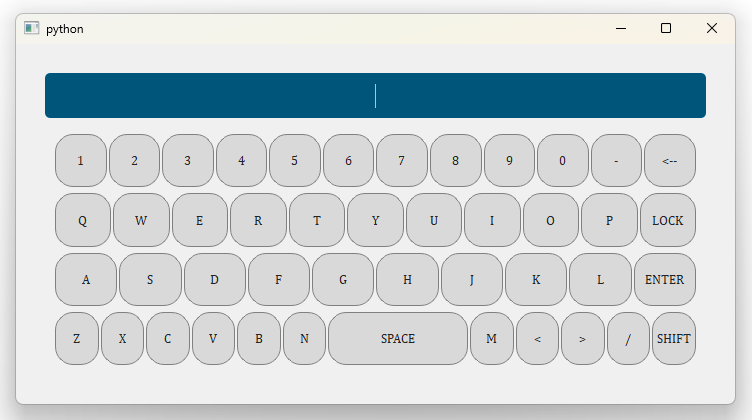

# Virtual Keyboard With PyQt6


([https://devguide.python.org/versions/])

## How to use:

- import
```python
  from VirtualKeyboard import VirtualKeyboard
```

- call
```python
  keyboard = VirtualKeyboard()
  keyboard.signal_lineedit_content.connect(self.function)
  keyboard.exec()
```


- excute
```python
  import sys
  frpm PyQt6 import QtWidgets, QtGui, QtCore
  from VirtualKeyboard import VirtualKeyboard
  
  class MainWidget(QtWidgets.QWidget)
    def __init__(self)
      super().__init__(self)
  
      keyboard = VirtualKeyboard()
      keyboard.signal_lineedit_content.connect(self.my_function)
      keyboard.exec()

    def my_function(self, text):
      print(f"{text=}")
```


##

##

